<div align="center">


# DermaHealth

<p><em>Smarter care. Smoother operations.</em></p>


<p>
	Nền tảng điều phối và chăm sóc bệnh nhân cho phòng khám và cơ sở y tế, được thiết kế theo luồng nghiệp vụ thực tế và phân quyền rõ ràng theo vai trò.
</p>

<p>
	<a href="#tổng-quan">Tổng quan</a> ·
	<a href="#điểm-nổi-bật">Điểm nổi bật</a> ·
	<a href="#luồng-vận-hành">Luồng vận hành</a> ·
	<a href="#công-nghệ-sử-dụng">Công nghệ</a> ·
	<a href="#chạy-dự-án">Chạy dự án</a>
</p>

</div>

<table>
	<tr>
		<td width="58%" valign="top">
			<h2 id="tong-quan">Tổng quan</h2>
			<p>
				DermaHealth là giao diện web mô phỏng một hệ sinh thái vận hành y tế số, tập trung vào đặt lịch, check-in QR, quản lý hàng đợi, theo dõi hành trình khám, xử lý hồ sơ và điều phối quy trình nội bộ.
			</p>
			<p>
				Trải nghiệm được chia theo từng nhóm người dùng để hệ thống vừa dễ trình bày trên GitHub, vừa đủ gần với cách một phòng khám thực sự vận hành.
			</p>
		</td>
		<td width="42%" valign="middle" align="center">
			
		</td>
	</tr>
</table>

## Điểm nổi bật

<table>
	<tr>
		<td width="33%" valign="top">
			<strong>Bệnh nhân</strong>
			<br />
			Đặt lịch, xem lịch hẹn, theo dõi tiến triển điều trị, quản lý hồ sơ và nhận các nhắc nhở cần thiết.
		</td>
		<td width="33%" valign="top">
			<strong>Nhân sự y tế</strong>
			<br />
			Điều phối hàng đợi, check-in, review lâm sàng, quản lý lượt khám và xử lý tác vụ theo vai trò.
		</td>
		<td width="33%" valign="top">
			<strong>Quản trị vận hành</strong>
			<br />
			Theo dõi workflow, audit log, trạng thái tích hợp và các cảnh báo vận hành trong hệ thống.
		</td>
	</tr>
</table>

### Tính năng nổi bật

- Phân quyền theo vai trò để chỉ hiển thị đúng chức năng cho từng nhóm người dùng.
- Luồng khám được tổ chức rõ ràng từ đặt lịch, check-in đến hoàn tất điều trị.
- Giao diện điều phối hàng đợi phù hợp môi trường vận hành tại cơ sở y tế.
- Có các màn hình riêng cho kiosk, workflow editor, hồ sơ và theo dõi tiến triển.
- Xử lý trạng thái rỗng và lỗi thân thiện để tăng độ ổn định khi sử dụng.

## Luồng vận hành

<div align="center">
	
</div>

> Song song với hành trình khám, hệ thống duy trì workflow nội bộ, audit log và trạng thái tích hợp để hỗ trợ đội ngũ vận hành.

## Công nghệ sử dụng

- React 19
- TypeScript
- Vite
- Ant Design
- Sass
- React Router
- Highcharts
- @xyflow/react
- dnd-kit

## Cấu trúc dự án

- `src/pages`: các màn hình nghiệp vụ chính.
- `src/layouts`: shell, header, sidebar và bố cục ứng dụng.
- `src/components`: thành phần dùng lại theo domain và UI.
- `src/domain`: mô hình nghiệp vụ, repository và service mô phỏng luồng vận hành.
- `src/state`: quản lý trạng thái ứng dụng.
- `src/styles`: hệ thống style, token và layout.

## Chạy dự án

```bash
npm install
npm run dev
```

## Scripts

```bash
npm run dev
npm run build
npm run lint
npm run preview
```

## Ghi chú

Dự án này phù hợp để trình bày trên GitHub như một sản phẩm demo nội bộ hoặc nền tảng nguyên mẫu cho hệ thống chăm sóc y tế số. Nếu muốn, có thể bổ sung thêm ảnh chụp màn hình, sơ đồ kiến trúc và hướng dẫn triển khai để README nhìn “đã mắt” hơn nữa.
